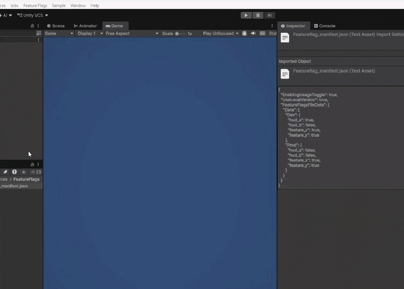
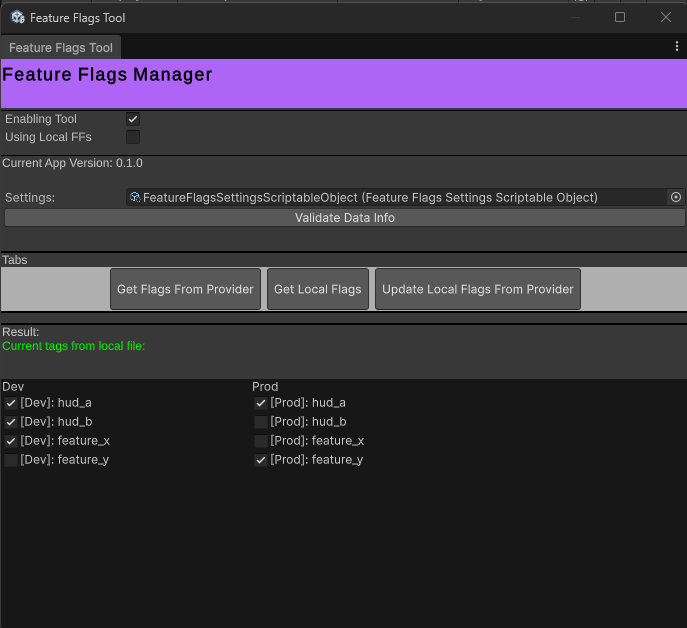
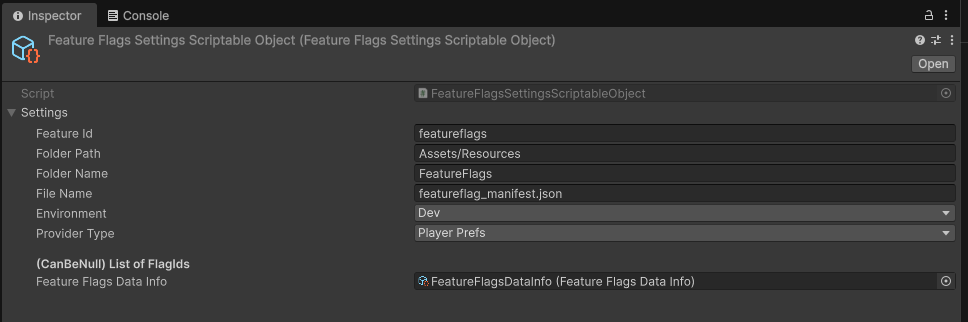

# Unity Feature Flags

### Editor/Runtime Tool for create and manage Feature Flags made by Unity UIToolkit

## Big Pros by using Feature Flags

1. Easy way to make and control AB tests
2. Turn On/Off features without making new builds
3. Helpful to test and introduce new features
4. Local/Offline safety version of the flags

### How to Use:

Following the videos above, you can access the main window in 'Feature Flags/Open'

1. Toogle On/Off to Enable/Disable  the usage 
2. Toogle On/Off to enable the usage of local or 'online' version
3. Access the Settings to apply your custom configuration such as Paths and Providers
4. Tap in the action buttons to set the changes of the flag

## Component Overview

### Feature Flag Tool (UIToolkit Window): 

### FeatureFlagSettings (Scriptable Object): 

The implementation follows a settings as a source of truth that allows to set different behaviors: 

- *Provider Type*: The implementations available for types of asset providers. At this moment, standard bundles are implemented , but the solution allow us to provide Addressables or custom asset provideres

- *Loading Type*: If it is to loading all game objects and cache it, or loading each game object if it is requested.(Note: after load it, it has been cache it as well)

- *Streaming AssetPath*: The path to build the bundles.

### Architecture Overview:

### How to expand: 

- 

### Next improvements: 

- For all the Async Flow, it can be done by using Tasks with zero memory allocation in the future:(https://github.com/cysharp/unitask)
