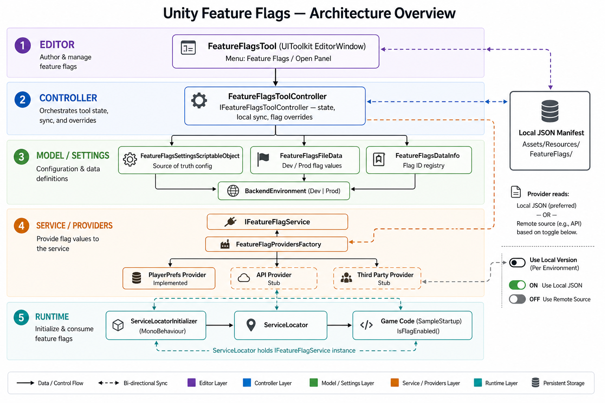

# Unity Feature Flags

### Editor/Runtime Tool for create and manage Feature Flags made by Unity UIToolkit

## Big Pros by using Feature Flags

1. Easy way to make and control AB tests
2. Turn On/Off features without making new builds
3. Helpful to test and introduce new features
4. Flags Status separated by environments (Dev/Prod)
5. Local/Offline safety version of the flags

### How to Use:

Following the videos above, you can access the main window in 'Feature Flags/Open'

1. Toogle On/Off to Enable/Disable  the usage 
2. Toogle On/Off to enable the usage of local or 'online' version
3. Access the Settings to apply your custom configuration such as Paths and Providers
4. Tap in the action buttons to set the changes of the flag

## Architecture/Components Overview

### Feature Flag Tool (UIToolkit Window): 

The main window allows you to set the current usage of the flags, such as toogle on off the source, access the main settings and fecht the flags:

NOTE:  Every change on this window will update a json manifest with a state machine approach. 

- *Get Flags From Provide*: Will return a read-only version of the flags from the provider that is current set in the FeatureFlagSettings (Scriptable Object)

- *Get Local Flags*: Will return the local flags from a JSON manifest that can be changed anytime.

- *Update Local Flags From Provider*: Will override all the changes on the local manifest json by using the version from the provider set in the FeatureFlagSettings (Scriptable Object)

### FeatureFlagSettings (Scriptable Object): 

The settings files has encapsulated model to use rules for the usage of the feature, such as : 

- *Principal Paths*: Paths and String Ids for the saving/updating process

- *Environment*: The current environment that will be used at runtime

- *Provider Type*: The available providers to set for the flags. It can be from Player Prefs, APIs or Third Parties

- *Feature Flags Data Info*: List of strings that can be used local as a flag id list. It is an optional usage that is being used from the Player Prefs implementation.

### How to expand: 

- Adding More Providers can be done by implementing a new class from *IFeatureFlagService*, adding that instance to the factory in *FeatureFlagProvidersFactory* and set the new enum in *FeatureFlagsSettingsScriptableObject.FeatureFlagsSettings.Providers* 

### Next improvements: 

- For all the Async Flow, it can be done by using Tasks with zero memory allocation in the future:(https://github.com/cysharp/unitask)
